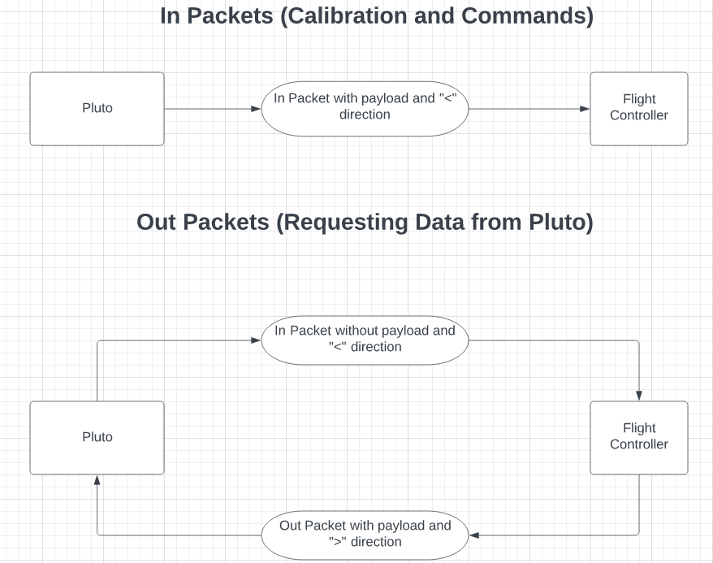

=======================================
dagger
=======================================

.. image:: https://github.com/rohithvarma3000/dagger/actions/workflows/python-package.yml/badge.svg
   :target: https://github.com/rohithvarma3000/dagger/actions/workflows/python-package.yml
   :alt: Python package
.. image:: https://readthedocs.org/projects/dagger-docs/badge/?version=latest
    :target: https://dagger-docs.readthedocs.io/en/latest/?badge=latest
    :alt: Documentation Status
.. image:: https://codecov.io/gh/rohithvarma3000/dagger/branch/main/graph/badge.svg?token=VtrYdLrEMV
   :target: https://codecov.io/gh/rohithvarma3000/dagger
.. image:: http://img.shields.io/badge/license-MIT-blue.svg
   :target: https://raw.githubusercontent.com/rohithvarma3000/dagger/main/LICENSE
   :alt: License

**A Python implementation for controlling Pluto Drone.**

Installation
============

Installing the package from source
----------------------------------

1. Get the latest source by cloning this repo: ::

      git clone https://github.com/rohithvarma3000/dagger.git

2. Change to dagger folder: ::
      
      cd dagger

3. Install the dependencies: ::

      pip install -r requirements.txt

4. Install dagger: ::

      pip install .

Examples
========

Connecting to Pluto ::

      import dagger
      Pluto_IP = "192.168.4.1"
      Pluto_PORT = 23
      pluto = dagger.PlutoConnection()
      pluto.connect((Pluto_IP, Pluto_PORT))

Intiating the SetRawRc Object for Controlling the pluto Drone using the RC params ::

      rc = dagger.SetRawRC(pluto)

Arming the drone ::

      rc.arm_drone()

Disarming the drone::

   rc.disarm_drone()

General Information
===================

- `Website and Documentation <link URL>`_
- `Tutorial <https://github.com/rohithvarma3000/dagger/blob/main/tutorials/dagger_example.ipynb>`_

How to Use?
===========
Refer to our `tutorial <https://github.com/rohithvarma3000/dagger/blob/main/tutorials/dagger_example.ipynb>`_ to get started with dagger

==================
Working Principles
==================

Sockets
=======

We connected to Pluto first by connecting our device to the drone's hotspot, then we used TCP sockets to connect
to the drone using IPV4 scheme and ``socket`` library in python to do the same. The server iss hosted at ``192.168.4.1:23``
We sent the MSP Packet data encoded as bytes to pluto using sockets, the details about the packet is explained below. 

MSP Packets
===========

We used `MSP Packet scheme <http://www.multiwii.com/wiki/index.php?title=Multiwii_Serial_Protocol&oldid=680>`_ to communicate with Pluto, ie send commands, request data and calibrate the drone.
The data of the packet was first encoded into bytes and then sent as a byte stream (array of bytes) to the drone.
The basic structure of the packet has been explained below.

Structure of the Packet
-----------------------

+--------+-----------+----------------+-----------------+--------------+----------+
| Header | Direction | Message Length | Type of Payload | Message Data | Checksum |
+========+===========+================+=================+==============+==========+
| 2 Bytes|  1 Byte   |    1 Byte      |     1 Byte      |   N Bytes    |  1 Byte  |
+--------+-----------+----------------+-----------------+--------------+----------+

Details of the Packet
---------------------

+-----------------+------------+---------------------------------------------------------------------+
| Type of Byte    | ASCII      | Hexadecimal                                                         |
+=================+============+=====================================================================+
| Header          | $M         | 0x24 0x4d                                                           |
+-----------------+------------+---------------------------------------------------------------------+
| Direction       | '<' or '>' | 0x3c (to the drone) or 0x3e (from the drone)                        |
+-----------------+------------+---------------------------------------------------------------------+
| Message Length  |            | 0x00 - 0xff                                                         |
+-----------------+------------+---------------------------------------------------------------------+
| Type of Payload |            | 0x01 - 0xff                                                         |
+-----------------+------------+---------------------------------------------------------------------+
| Payload         |            | Message Body encoded into N bytes                                   |
+-----------------+------------+---------------------------------------------------------------------+
| Checksum        |            | XOR of Bytes of  “Msg length”, “Command” and all bytes of “Payload” |
+-----------------+------------+---------------------------------------------------------------------+

+---------------------------------------+
|            MSP COMMANDS               |
+=================+=====================+
| MSP_RAW_IMU     | MSP_ALTITUDE        |
+-----------------+---------------------+
| MSP_SET_RAW_RC  | MSP_ANALOG          |
+-----------------+---------------------+
| MSP_SET_COMMAND | MSP_ACC_CALIBRATION |
+-----------------+---------------------+
| MSP_ATTITUDE    | MSP_MAG_CALIBRATION |
+-----------------+---------------------+

+----------------+------------------------------------+
| MODULE         | DESCRIPTION                        |
+================+====================================+
| AccCalibration | Calibrates the accelerometer       |
+----------------+------------------------------------+
| Altitude       | Get the Altitude data from Pluto   |
+----------------+------------------------------------+
| Attitude       | Get the Attitude data from Pluto   |
+----------------+------------------------------------+
| Analog         | Get the Analog data from Pluto     |
+----------------+------------------------------------+
| MagCalibration | Calibrates the magnetometer        |
+----------------+------------------------------------+
| PlutoConnection| Defines API Connection             |
+----------------+------------------------------------+
| PlutoControl   | Controls for the Pluto Drone       |
+----------------+------------------------------------+
| RawIMU         | Get the RawIMU data from Pluto     |
+----------------+------------------------------------+
| SetCommand     | Sets the command in Pluto          |
+----------------+------------------------------------+
| SetRawRC       | Controls the pluto using RC params |
+----------------+------------------------------------+

.. _dagger : https://github.com/rohithvarma3000/dagger.git

